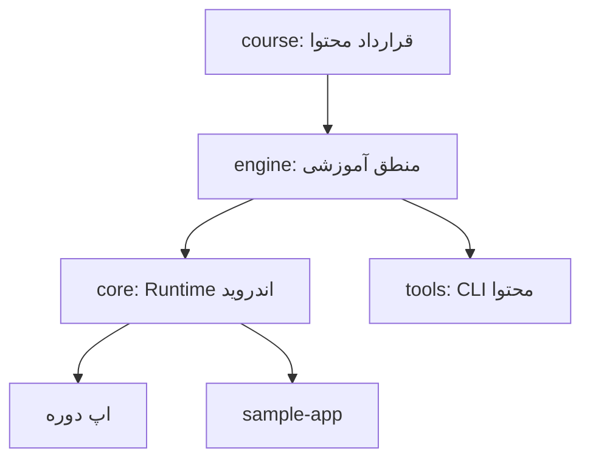
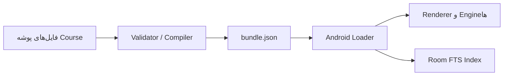

# معماری AS Academy Core

## هدف

`AS-Academy-Core` پلتفرم مشترک اپ‌های آموزشی است، نه یک Course خاص. طراحی به‌گونه‌ای است که یک اپ مستقل JavaScript و یک اپ All-in-One چنددوره‌ای هر دو همان Runtime و موتورهای عمومی را مصرف کنند.

## جهت وابستگی



هیچ ماژول پایین‌دستی نباید به Host یا Course خاص وابسته شود. `course` و `engine` عمداً Kotlin/JVM هستند تا Validator و ابزار انتشار بدون Android SDK اجرا شوند.

## مرزها

### Core مالک چیست؟

- App Shell، Navigation و Design System
- Room schema، DAO، Migration و Repository
- Profile، Settings، Drawer، About و Study Reminder
- Content decode/validation/import/update/rollback
- Lesson Renderer، Progress، Quiz، Exercise، Project، Search و Achievement
- Bookmark، User Note، Backup/Restore و Code Runner contract

### Course مالک چیست؟

- سرفصل، درس، Quiz، Exercise، Project و Glossary همان موضوع
- Asset، منبع، رنگ و هویت بصری همان دوره
- Capability configuration
- Adapter اختصاصی موضوع؛ مثلاً Runner امن JavaScript یا Viewer مدار

Course حق ساخت نسخه محلی از APIهای Core را ندارد. اگر Core یک Slot یا Plugin مورد نیاز را ندارد، ابتدا قرارداد عمومی آن در Core اضافه می‌شود.

## جریان محتوا



CLI و Android Loader از `CoursePackageCodec` و `CoursePackageValidator` یکسان استفاده می‌کنند؛ بنابراین محتوایی که CI پذیرفته با قواعد متفاوتی در Runtime روبه‌رو نمی‌شود.

## جریان داده کاربر

```text
Compose UI -> ViewModel/State holder در Host -> Core Repository -> Room/DataStore
```

UI نباید DAO را مستقیم صدا بزند. Course Package داده قابل بازسازی است، اما Progress، Note، Draft و نتیجه Quiz داده کاربرند و در Migration یا Content Update حذف نمی‌شوند.

## Offline First

Bundle اولیه داخل assets اپ قرار می‌گیرد. درس، جست‌وجو، Bookmark، آزمون، تمرین، Progress و Backup بدون شبکه کار می‌کنند. شبکه فقط یک Source اختیاری برای دریافت Bundle جدید یا Sync آینده است؛ Core به سرویس مشخصی قفل نشده است.

## توسعه قابلیت اختصاصی

قابلیت‌های عمومی از APIهای کوچک قابل تزریق استفاده می‌کنند. برای نمونه، هر زبان `CodeRunnerPlugin` خود را ثبت می‌کند، اما Request/Result، Timeout metadata و Registry در Core باقی می‌مانند. همین الگو برای Asset renderer یا destinationهای Navigation اختصاصی قابل استفاده است.

## محورهای نسخه

| محور | محل | کاربرد |
|---|---|---|
| Core API | `CoreVersion.CURRENT` | سازگاری Runtime |
| Database | `@Database(version = 3)` | Migration داده کاربر و یکسان‌سازی شاخه‌های آزمایشی |
| Course Schema | `CoreVersion.COURSE_SCHEMA` | شکل JSON قابل خواندن |
| Course Content | `manifest.version` | انتشار محتوای یک دوره |
| Curriculum | `manifest.curriculumVersion` | تغییر برنامه آموزشی |
| App | `versionName/versionCode` Host | انتشار فروشگاه |

این شماره‌ها نباید به جای یکدیگر استفاده شوند.
