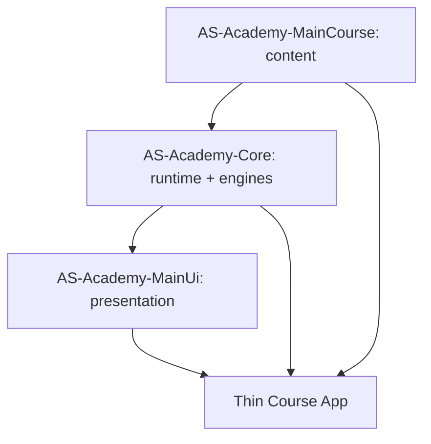

# معماری AS Academy Foundation 1.5

## هدف

`AS-Academy-Core` موتور و Runtime مشترک است. معماری Foundation عمداً مسئولیت‌ها را بین سه Repository جدا می‌کند تا هیچ اپ دوره‌ای نسخه محلی و واگرا از runtime، UI یا محتوا نسازد.

## جهت وابستگی



در داخل Core:

```text
course <- engine <- core
             ^
             |
           tools
```

`course` و `engine` Kotlin/JVM باقی می‌مانند تا validation و tooling بدون Android SDK قابل اجرا باشند.

## Single Source of Truth

### Core

مالک این موارد است:

- `AcademyRuntime` و composition تمام runtime dependencyها
- Room schema، DAO، migration و repository
- public domain/read models
- DataStore، WorkManager و notification scheduling
- content codec/validation/update/install/rollback
- backup/restore
- engineهای Progress، Quiz، Exercise، Project، Search، Review، Placement و Achievement
- `AcademyBackend` و مرزهای Auth / Sync / Storage

Core **Compose presentation، App Shell، Drawer، Theme یا navigation UI** را نگهداری نمی‌کند.

### MainUi

مالک presentation مشترک است:

- Design System و Theme
- Screenها و componentها
- navigation/presentation shell
- rendering و UX آموزشی
- reference application در `academy-viewer`

MainUi فقط public APIهای Core را consume می‌کند. ساخت مستقیم `AcademyDatabase`، DAO، Room implementation یا provider client مانند Supabase در MainUi ممنوع است.

### MainCourse

فقط محتوای آموزشی و metadata نسخه‌دار را نگهداری می‌کند:

- Lesson
- Quiz
- Exercise
- Project
- Glossary/Resources/Assets
- Manifest و curriculum metadata

Runtime implementation، database، UI framework یا backend SDK نباید وارد MainCourse شود.

## جریان داده کاربر

```text
MainUi -> AcademyRuntime public repositories -> Room/DataStore
```

Presentation به Entity/DAO به‌عنوان implementation وابسته نمی‌شود. Core entityها را به public modelها map می‌کند.

## جریان محتوا

```text
MainCourse editable content
        |
        v
Core Validator / Compiler
        |
        v
validated package / bundled snapshot / HTTPS runtime channel
        |
        v
Core content runtime
        |
        v
MainUi renderer
```

Content Package قابل بازسازی است؛ Progress، Notes، Quiz History و Draftها داده کاربر هستند و مستقل نگهداری می‌شوند.

## Backend boundary

Foundation به provider خاصی قفل نیست. `AcademyBackend` سه gateway عمومی دارد:

- Auth
- Sync
- Storage

`OfflineAcademyBackend` default است. providerهایی مثل Supabase فقط پشت این boundary پیاده‌سازی می‌شوند. secret key یا service-role credential نباید در Android client یا Repository قرار گیرد.

## Offline-first

Bundled content و local user state بدون شبکه کار می‌کنند. شبکه فقط برای update/sync اختیاری است. خرابی remote backend نباید دسترسی به محتوای معتبر local را از بین ببرد.

## Contract و versioning

مرجع machine-readable: `integration/contract.json`.

| محور | مقدار Foundation 1.5 | کاربرد |
|---|---:|---|
| Core API | 1.5.0 | runtime/public API compatibility |
| Contract | 1 | compatibility بین سه repo |
| Database | 4 | migration داده کاربر |
| Course Schema | 1 | JSON contract |
| Backup Schema | 3 | backup compatibility |
| Android | min 23 / compile 36 | platform baseline |
| Java | 17 | toolchain baseline |

`manifest.version`، `minimumCoreVersion` و `contentSchemaVersion` مستقل از version اپ هستند و نباید با هم جایگزین شوند.

## Reference App و E2E

Reference app رسمی در `AS-Academy-MainUi/academy-viewer` قرار دارد. Workflow `Foundation Integration` از Core هر سه Repository را checkout می‌کند، Contractها را compare/validate می‌کند، Core و MainUi را test می‌کند و reference app را assemble می‌کند.

این workflow مرجع نهایی سازگاری Foundation است.
